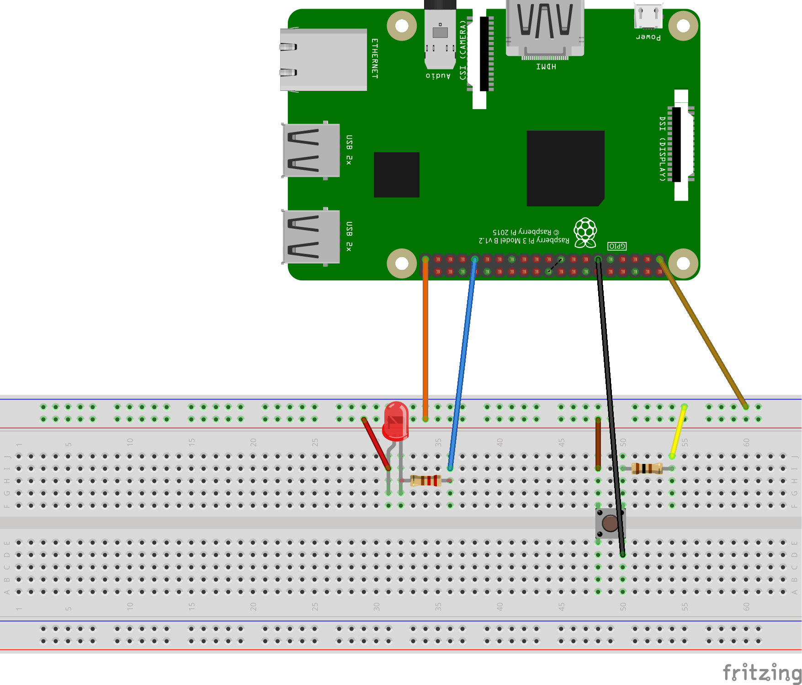

# IoTButton

This repo is the sample code presented as part of the Reactor Twitch Stream on the Microsoft Developer Twitch account. This creates a smart IoT Button, which when pressed lights up an LED locally and sends a Twitter message via [Azure IoT Hub](https://azure.microsoft.com/en-us/services/iot-hub/) and [Azure Logic Apps](https://docs.microsoft.com/en-us/azure/logic-apps/logic-apps-overview). 

## Coming soon

If you have come here from the Twitch Stream, come back to find the link for the direct link to the video here! 

Bookmark, Subscribe the [Reactor YouTube channel](https://www.youtube.com/channel/UCkm6luGCS3hD25jcEhvRMIA) to get the notification for this video and other amazing content!​

## Connect the components 

You’ll need a few components:

*   a [Raspberry Pi 2 or 3](https://www.adafruit.com/product/3055)

*   a [full or half sized breadboard](https://www.adafruit.com/product/239)

*   some [male to male jumper wires](https://www.adafruit.com/product/758)

*   some [female to male jumper wires](https://www.adafruit.com/product/3633)

*   a couple of [resistors](https://www.adafruit.com/product/4293)

*   a [tactile switch](https://www.adafruit.com/product/367)

*   Micro USB cable to connect Raspberry Pi to power source

once that is sorted, 

### Setting up your breadboard

### Prerequisites 

This sample assumes completion of Raspberry Pi setup for .NET Development and Blinky Sample that can be found explained in detail in the [.NET 101 Series for IoT](https://dotnet.microsoft.com/learn/videos)

*   [YouTube Link](https://www.youtube.com/playlist?list=PLdo4fOcmZ0oVZN5yrJbnJ70tMe9itQ10W)
*   [Channel9 Link](https://aka.ms/IoTNet101)

>**NOTE**
In the video series, the Raspberry Pi is connecting to the internet via ***Ethernet cable***. If you are following this from the MS Developer Twitch/Video Stream, you will notice there is no Ethernet cable, I setup the Rasbperry Pi to connect to the interwebs via ***WiFi***. Either way, for the repo in this sample, the Raspberry Pi needs interweb connection and you can connect via either method, whatever works best for you. 

## Setup for VSCode Remote Debugging

This makes it easy to debug the code being run on the Raspberry Pi. To make this work for this sample repo, after completing the SSH steps explained in the *Prerequisites* , you can update the [publish.bat](https://github.com/Sweekriti91/IoTButton/blob/main/publish.bat) with the values. 

With that set, we follow the steps in Scott Hanselman's Blog [Remote debugging with VS Code on Windows to a Raspberry Pi using .NET Core on ARM](https://www.hanselman.com/blog/RemoteDebuggingWithVSCodeOnWindowsToARaspberryPiUsingNETCoreOnARM.aspx)

Useful links : 

*   [Install .NET Core SDK on the Raspberry Pi](https://www.hanselman.com/blog/InstallingTheNETCore2xSDKOnARaspberryPiAndBlinkingAnLEDWithSystemDeviceGpio.aspx)

*   [.NET Binaries download link](https://dotnet.microsoft.com/download/dotnet-core/thank-you/sdk-3.1.301-linux-arm32-binaries)

*   [.NET Core Downloads Page](https://dotnet.microsoft.com/download/dotnet-core/3.1)

*   Editing launch.json and tasks.json [Follow Hanselman's blog + [this link]( https://github.com/OmniSharp/omnisharp-vscode/wiki/Remote-Debugging-On-Linux-Arm#prerequisites])]

## Create your Azure Services

Excellent, at this point, we can connect our IoT device to the great wild internet.

1. [Create IoT Hub](https://docs.microsoft.com/en-us/azure/iot-hub/iot-hub-raspberry-pi-kit-node-get-started#create-an-iot-hub)

2. [Register the Raspberry Pi device](https://docs.microsoft.com/en-us/azure/iot-hub/iot-hub-raspberry-pi-kit-node-get-started#register-a-new-device-in-the-iot-hub)

3. Update the ***DeviceConnectionString*** and ***DeviceID*** from values in Step 2 in [Program.cs](https://github.com/Sweekriti91/IoTButton/blob/main/Program.cs#L14)

4. Setup Azure IoT Tools for VS Code to monitor the default IoT Hub Device end point for messages. This is super easy to setup by following the [documentation](https://docs.microsoft.com/en-us/azure/iot-hub/iot-hub-vscode-iot-toolkit-cloud-device-messaging)

Congratulations! At this point, you can deploy the app to your Raspberry Pi, press the button and you will see messages appear in the VSCode output window. 

## Let's add a Logic App! 

For this section, we are combining the steps in 2 different MS Doc tutorials. We will setup the intitial service bus, message routing and the initial logic app setup from this tutorial [here](https://docs.microsoft.com/en-us/azure/iot-hub/iot-hub-monitoring-notifications-with-azure-logic-apps). But for the fun twist, instead of email, we'll be using the Twitter Logic App Connector and steps for that can be found [here](https://docs.microsoft.com/en-us/azure/connectors/connectors-create-api-twitter). 

And for the last fun bit, lets parse the IoT Message JSON value to Tweet our specific message by using the doc [here](https://docs.microsoft.com/en-us/azure/logic-apps/logic-apps-perform-data-operations#parse-json-action).

Wahoo! If you made it this far, you are now tweeting via the button on your breadboard connected to a Smart Raspberry Pi, and all of it with the Power of .NET! 

## Additional resources

* [Raspberry Pi online simulator](https://docs.microsoft.com/en-us/azure/iot-hub/iot-hub-raspberry-pi-web-simulator-get-started)

* [.NET 101 Series for IoT and C# and Visual Studio and more!](https://dotnet.microsoft.com/learn/videos)

* [.NET Core IoT Samples](https://github.com/dotnet/iot/tree/master/samples)

* [.NET Core IoT Documentation](https://github.com/dotnet/iot/tree/master/Documentation)

* [System.Device.Gpio](https://github.com/dotnet/iot/tree/master/src/System.Device.Gpio)

* Hackster.io Post [Build .NET Core IoT for Raspberry Pi Linux & Azure IoT Hub](https://www.hackster.io/glovebox/build-net-core-iot-for-raspberry-pi-linux-azure-iot-hub-f095f5#toc-system-device-gpio-4)

